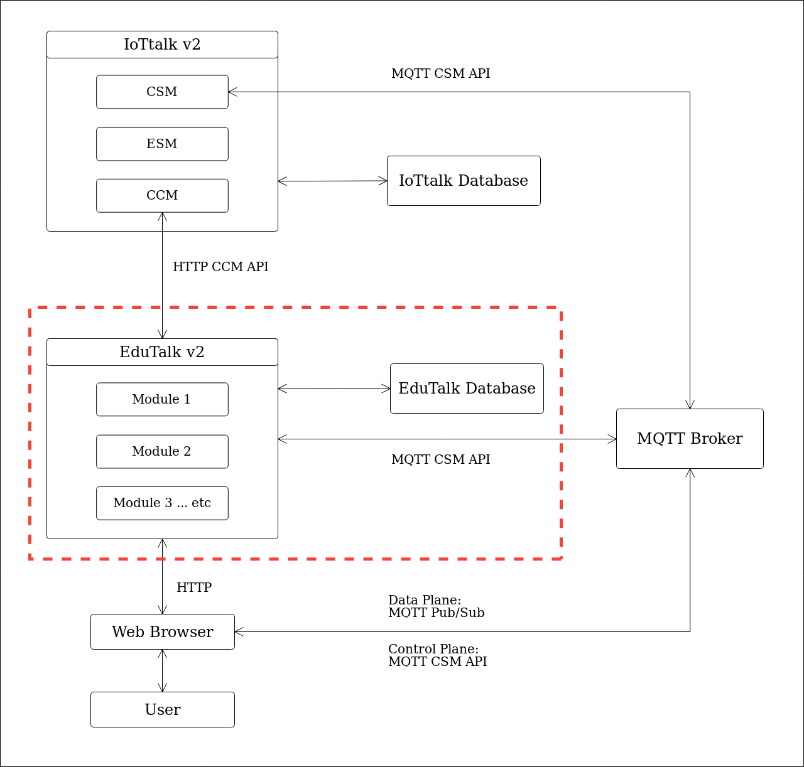

EduTalk v2 Architecture
==========================

EduTalk v2 的架構上，會與 IoTtalk v2 本身做 decoupling。
對 EduTalk server 而言，IoTtalk 將被視為一外部 service。

IoTtalk CSM API
----------------

Device application 之 register, deregister, connect, disconnect, data subscribe/publish, 已經透過 DAN 提供了。

IoTtalk CCM API
----------------

其中 EduTalk 所需之 IoTtalk CCM API 為下列：

#. IoTtalk account management API

   #. Account creation

      - ``POST /api/v0/account/create/``

   #. User authentication

      - ``POST /api/v0/account/login/``
      - ``GET /api/v0/account/logout/``

#. IoTtalk project management API

   #. Create project

      - ``PUT /api/v0/project/``

   #. Retrieve project info

      - Project list: ``GET /api/v0/project/``
      - Single Project: ``GET /api/v0/project/<id>/``

   #. Update project info

      #. Project name

      - ``POST /api/v0/project/<id>/``

   #. Delete Project

      - ``DELETE /api/v0/project/<id>/``

   #. Connection

      #. Add connection
      #. Delete connection
      #. Change join function
      #. Change device feature function
      #. Retrieve connection info

         #. IDF/ODF topics

   #. IoTtalk device object management API

      #. Create device object
      #. Delete device object
      #. Retrieve device object info
      #. Update device object

         #. Device binding
         #. Device unbinding

#. IoTtalk device model management API

   #. Create device model
   #. Delete device model
   #. Update device model
   #. Retrieve device model list

      #. For showing available VPython models

實作相關 issue
--------------

#. 以不更動目前 EduTalk 之 GUI 為原則
#. 訂定 Public 之 IoTtalk API，可能以 MQTT 或是 HTTP API 提供。
#. 採用 API versioning 之設計，API 本身將會有版本，在提供穩定 API 之後，仍可以兼顧 API 修改與維護。

架構圖
------

